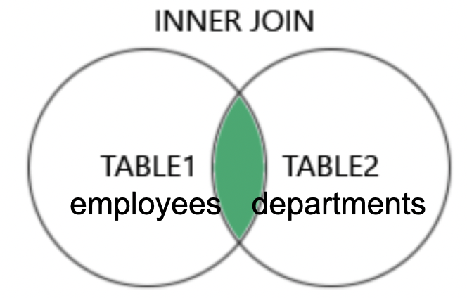
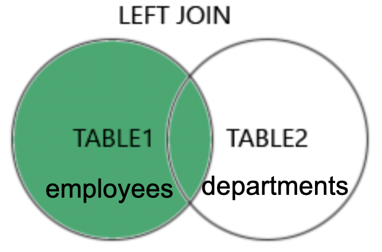
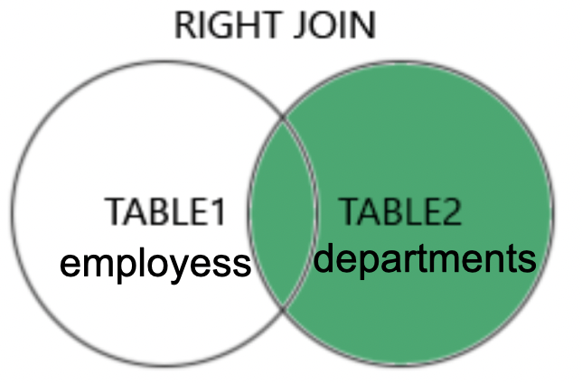

# Tech Company

**Deadline**: This is mandatory I and the deadline is in Teamsx§. 

**Hand-in**: Teams, hand in a link to the SQL file in your Git repository.

For the JOIN assignments you are more than welcome to solve the exercises together.

---

# Welcome to the company!

You have been hired as a DBA (Database Administrator). A DBA is responsible for managing and maintaining the database systems of the organization, ensuring their performance, security, and availability. One key role is to decide who gets access to what data. If a person needs more access to data they must come to you and ask for it. 

---

## Cheatsheet

#### INNER JOIN

```sql
SELECT *
FROM table_1
INNER JOIN table_2
    ON table_1.id = table_2.id
```

#### LEFT (OUTER) JOIN

```sql
SELECT *
FROM table_1
LEFT JOIN table_2
    ON table_1.id = table_2.id
```

#### RIGHT (OUTER) JOIN

```sql
SELECT *
FROM table_1
RIGHT JOIN table_2
    ON table_1.id = table_2.id
```

---

## Preparation

Run the script [tech_company.sql](./tech_company.sql) against a new database named `tech_company`. Then write your SQL queries in the MySQL CLI or DataGrip or similar. 

Solve the assignment by writing the SQL queries below each question. You can do that by wrapping the SQL code with:

\```sql

SQL CODE HERE

\```

---

## Single Table Assignments


Let's start with a couple of simple tasks to get you adjusted to your new role.

1. Find the employee number for employees named `MARTIN`.
```sql
SELECT employee_number FROM employees
WHERE employee_name='MARTIN';

```

2. Find the employee(s) with a salary greater than 1500.
```sql
SELECT employee_name FROM employees
WHERE salary > 1500;
```

3. List the names of salesmen that earn more than 1300.
```sql
SELECT employee_name FROM employees
WHERE (job_title='SALESMAN') AND (salary > 1300);
```

4. List the names of employees that are not salesmen.
```sql
SELECT employee_name FROM employees
WHERE NOT job_title='SALESMAN';
``` 

5. List the names of all clerks together with their salary with a deduction of 10%.  
```sql
SELECT employee_name, (salary*0.9) FROM employees
WHERE job_title='CLERK';
```

6. Find the name of employees hired before May 1981.
```sql
SELECT employee_name FROM employees
WHERE hire_date < '1981-05-01';
```

7. List employees sorted by salary in descending order (i.e. highest salary first).
```sql
SELECT employee_name, salary FROM employees
ORDER BY salary DESC;
```

8. List departments sorted by location.
```sql
SELECT department_name, office_location FROM departments
ORDER BY office_location;
```

9. Find name of the department located in New York.
```sql
SELECT department_name FROM departments
WHERE office_location='NEW YORK';
```

10. You have proven your worth at the company. Your colleague comes to you trying to remember `what's-his-name`. It starts with a `J` and ends with `S`. Can you help her?
```sql
SELECT employee_name FROM employees
WHERE employee_name LIKE 'J%S';
```

11. Maybe that wasn't helpful. "Oh yeah, I remember now!" they say and tell you that he is a manager.
```sql
SELECT employee_name FROM employees
WHERE employee_name LIKE 'J%S' AND job_title='MANAGER';
```

12. How many employees are there in each department?

<details> 
  <summary>Second Hint. Don't click unless absolutely stuck.</summary>
   Use GROUP BY.
</details>

```sql
SELECT d.department_name,
  COUNT(e.employee_number)
FROM departments d
  LEFT JOIN employees e
  ON d.department_number = e.department_number
GROUP BY d.department_name;
```


---

## Aggregate functions

1. For the first assignment, take on the hat of a Data Analyst. You've been tasked to create a summary of interesting data. 

Use `MIN`, `MAX`, `AVG`, `SUM`, `ORDER BY`, `BETWEEN` and more.

If you in this task manage to solve one of the next assignments, then pat yourself on the back! You are a valued employee at tech company. 
```sql
SELECT employee_name AS longest_hired, hire_date FROM employees
WHERE hire_date = (SELECT MIN(hire_date) FROM employees);  
```

```sql
SELECT MAX(salary) AS highest_salary FROM employees;
```

```sql
SELECT ROUND(AVG(salary)) AS average_salary FROM employees;
```

```sql
SELECT SUM(salary) AS monthly_salary_expense_total FROM employees;
```

```sql
SELECT job_title, salary FROM employees
ORDER BY job_title, salary DESC;
```

```sql
SELECT employee_name FROM employees
WHERE employee_name BETWEEN 'K' AND 'Z'
ORDER BY employee_name;
```

2. List the number of employees.
```sql
SELECT COUNT(employee_number) AS number_of_employees FROM employees;
```

3. List the sum of all salaries (excluding commission).
Done in 1.  
  
4. List the average salary for employees in department 20.
```sql
SELECT ROUND(AVG(salary)) AS avarage_salary FROM employees
WHERE department_number = 20;
```

5. List the unique job titles in the company.
```sql
SELECT DISTINCT job_title FROM employees
ORDER BY job_title;
```

6. List the number of employees in each department.
```sql
SELECT departments.department_name, COUNT(employees.department_number) AS number_of_employees
FROM departments
LEFT JOIN employees
ON departments.department_number = employees.department_number
GROUP BY departments.department_name
ORDER BY departments.department_name;
```

7. List in decreasing order the maximum salary in each department together with the department number.
```sql
SELECT departments.department_name, departments.department_number,
       MAX(employees.salary) AS department_max_salary
FROM departments
INNER JOIN employees
ON departments.department_number = employees.department_number
GROUP BY departments.department_number
ORDER BY department_max_salary DESC;
```

8. List total sum of salary and commission for all employees.
```sql
SELECT SUM(salary) + SUM(commission) FROM employees;
```


--- 

## JOIN Assignments

1. Create an `INNER JOIN` between `employees` and `departments` to get the department name for each employee. Show all columns.



```sql
SELECT *
FROM employees
JOIN departments
ON employees.department_number = departments.department_number;
```

2. Continue from the last task. Show two columns. The `employee_name` and their corresponding `department_name`. Oh, and can you sort them alphabetically (A-Z)?
```sql
SELECT employees.employee_name, departments.department_name
FROM employees
JOIN departments
ON employees.department_number = departments.department_number
ORDER BY employees.employee_name;
```

3. Now is the time to make a LEFT JOIN. Let's look at `employee_name` and `department_name` only. There is one more person this time who didn't show in the previous query. Who is it and why?



```sql
SELECT employees.employee_name, departments.department_name
FROM employees
LEFT JOIN departments
ON employees.department_number = departments.department_number
ORDER BY employees.employee_name;
```
>The employee named King didn't show with the INNER JOIN because KING has a foreign key to departments with the value null  
>  
>ON employees.department_number = departments.department_number
>- INNER JOIN demands identical values in this expression - null values are not accepted  
  

4. Consider this query:

```sql
SELECT departments.department_name, COUNT(employees.employee_number)
FROM employees
JOIN departments
    ON departments.department_number = employees.department_number
GROUP BY department_name;
```

One department is missing. Which one and why? (Look in the database).

>Operations department is missing  
>because no employee has the value for that department in their coloumn for department_number.  
>  
>The query uses INNER JOIN  
>ON departments.department_number = employees.department_number  
>-  INNER JOIN demands identical values in this expression - null values are not accepted  
  
5. To get the missing department change the previous query to use a RIGHT JOIN.


  
```sql
SELECT departments.department_name, COUNT(employees.employee_number)
FROM employees
RIGHT JOIN departments
    ON departments.department_number = employees.department_number
GROUP BY department_name;
```
  

>With RIGHT JOIN all rows in RIGHT, in this case departments, will be included  
>even if they are not related to a row in employees  


6. `SCOTT` sends you this query and asks you to run it. In order to assess whether it is information that `SCOTT` is privy to, you must first understand it. Describe in technical terms what this query does:

```sql
SELECT *
FROM employees employee
JOIN employees manager
    ON employee.manager_id = manager.employee_number
ORDER BY employee.employee_name;
```  

>This query INNER JOIN data from the same table without any foreign keys to other tables  
>It joins an employee with the employee that has the employee_number that matches manager_id of the initial employee  
>Since it is an INNER JOIN the employee King will not be part of the result because King has a null value in manager_id  


7. Get two columns: employees and their managers.
```sql
SELECT employee.employee_name AS employee, manager.employee_name AS employees_manager
FROM employees employee
JOIN employees manager
ON employee.manager_id = manager.employee_number
ORDER BY employee.employee_name;
```

8. Use the `HAVING` keyword (feel free to look it up) to show the departments with more than 3 employees. The `as number_of_employees` is so that you can reference the value later on in the query:

```sql
SELECT employees.department_number, COUNT(employees.department_number) as number_of_employees
FROM employees
GROUP BY department_number;
```

LAV DENNE OG VIDERE


9. Subquery time! Select the name and salary of employees whose salary is above average: `WHERE salary > (SELECT AVG(salary) FROM employees)`


---

## Join Table (Many-to-many)

1. Create a new table called  `leaders` and insert rows into it.

2. Create a new table called `employees_leaders` that should link the `employees` and `leaders` tables. This is called a join table. It will enable you to create a many-to-many relationship between employees and leaders (a leader can manage multiple employees and an employee can have multiple leaders). Try to figure it out yourself, otherwise here is the solution:

<details>
  <summary>Spoiler</summary>
  ```sql
CREATE TABLE employees_leaders (
    employee_number INT,
    leader_number INT,
    PRIMARY KEY (employee_number, leader_number),
    FOREIGN KEY (employee_number) REFERENCES employees(employee_number),
    FOREIGN KEY (leader_number) REFERENCES leaders(leader_number)
);
```
</details>

3. Create rows in `employees_leaders` that link employees to their respective leaders.

4. Create a many-to-many query between employees and leaders. It requires two JOIN statements. First you select from `employees`, then you join with `employees_leaders`, and finally you join again with `leaders`.
